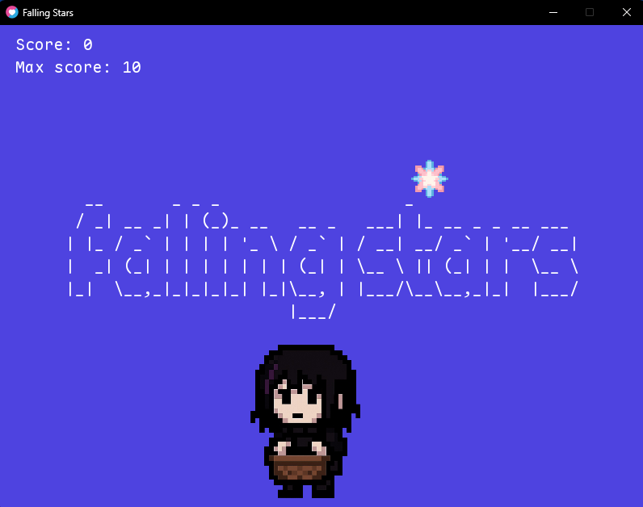

# 🌠 Falling Stars

**Falling Stars** é um mini-jogo casual feito com [LÖVE2D](https://love2d.org) onde você controla um personagem que coleta estrelas cadentes antes que elas toquem o chão. É simples, divertido e perfeito como projeto de portfólio para quem está aprendendo Lua e Love2D.

---

## 📸 Screenshot



> _(Você pode substituir essa imagem com um print do jogo rodando)_

---

## 🎮 Controles

- **← / →** – mover o personagem para esquerda ou direita
- **ESC** – sair do jogo

---

## 🛠️ Requisitos

- [LÖVE2D](https://love2d.org/) instalado (versão 11.3 ou superior)

Para instalar no Arch Linux (WSL ou nativo):

```bash
sudo pacman -S love
```

## 🚀 Como rodar o jogo

```bash
git clone https://github.com/seu-usuario/falling-stars.git
cd falling-stars
love .
```

## 💡 Ideias para expandir

- Adicionar vidas e sistema de Game Over
- Novos tipos de estrelas com efeitos diferentes
- Power-ups e obstáculos
- Menus e transições com animações
- Exportar para Web com love.js
